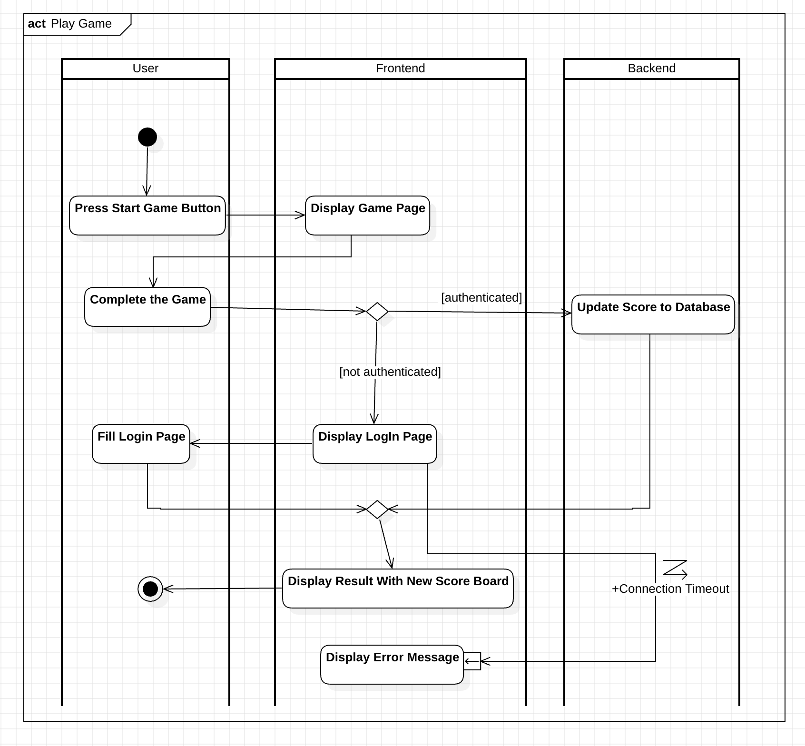
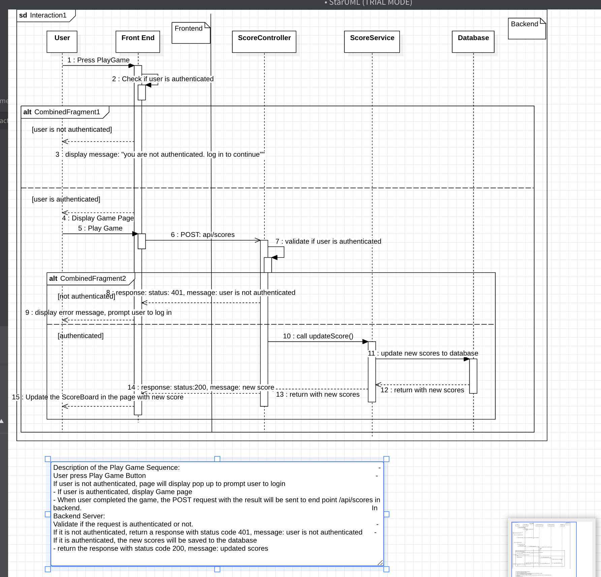

# A1
- Three ways of sum number from 0 to n:
  - Iteration from 0 to n, each time sum up the number : 1+2+3..n
  - Use high level function, reduce to sum up to the number n
  - user mathematical formula

# A2

# Jobs API (TypeScript + Express)

A simple REST API for managing jobs and users, built with **TypeScript**, **Express**, **MongoDB/Mongoose**, **JWT auth**, and helpful middlewares.

---

## 🚀 Tech Stack

- **Runtime:** Node.js
- **Language:** TypeScript
- **Web Framework:** Express
- **Database & ODM:** MongoDB + Mongoose
- **Auth:** JSON Web Tokens (JWT)
- **Utilities:** dotenv, cors, morgan, bcryptjs
- **Dev tooling:** ts-node-dev, TypeScript (`tsc`)

## How to start

### Prerequisit

- must have Mongodb Community instance run

### How to install and run the app on your machine

- Clone this project
- cd a2/
- change file named `.env.example`to `.env`
- npm i
- npm run dev

## API and test with POSTMAN

### API

#### Auth

- **POST** `/api/users/signup` – Create an account
- **POST** `/api/users/login` – Log in and receive a JWT

#### Jobs

- **GET** `/api/jobs` – List jobs (public)
- **GET** `/api/jobs/:jobId` – Get a job by ID (public)

#### Protected (requires `Authorization: Bearer <token>`)

- **POST** `/api/jobs` – Create a job
- **PUT** `/api/jobs/:jobId` – Update a job
- **DELETE** `/api/jobs/:jobId` – Delete a job

---

### Example SignUp Body request

```
{
    "name":"test",
    "username":"test",
    "password":"password"
}
```

### Example Job Body Request

```
{
  "title": "Software Developer",
  "type": "full-time",
  "description": "We are looking for an experienced software developer...",
  "company": {
    "name": "Tech Corp",
    "contactEmail": "jobs@techcorp.com",
    "contactPhone": "+1234567890"
  }

}
```

# A3

## Requirement

1. We have a website with a score board, which shows the top 10 user’s scores.
2. We want live update of the score board.
3. User can do an action (which we do not need to care what the action is), completing this action will increase the user’s score.
4. Upon completion the action will dispatch an API call to the application server to update the score.
5. We want to prevent malicious users from increasing scores without authorisation.

## Diagram

These are the Sequence Diagram and Activity Diagram of a3

- Activity diagram
  
- Sequence diagram
  
